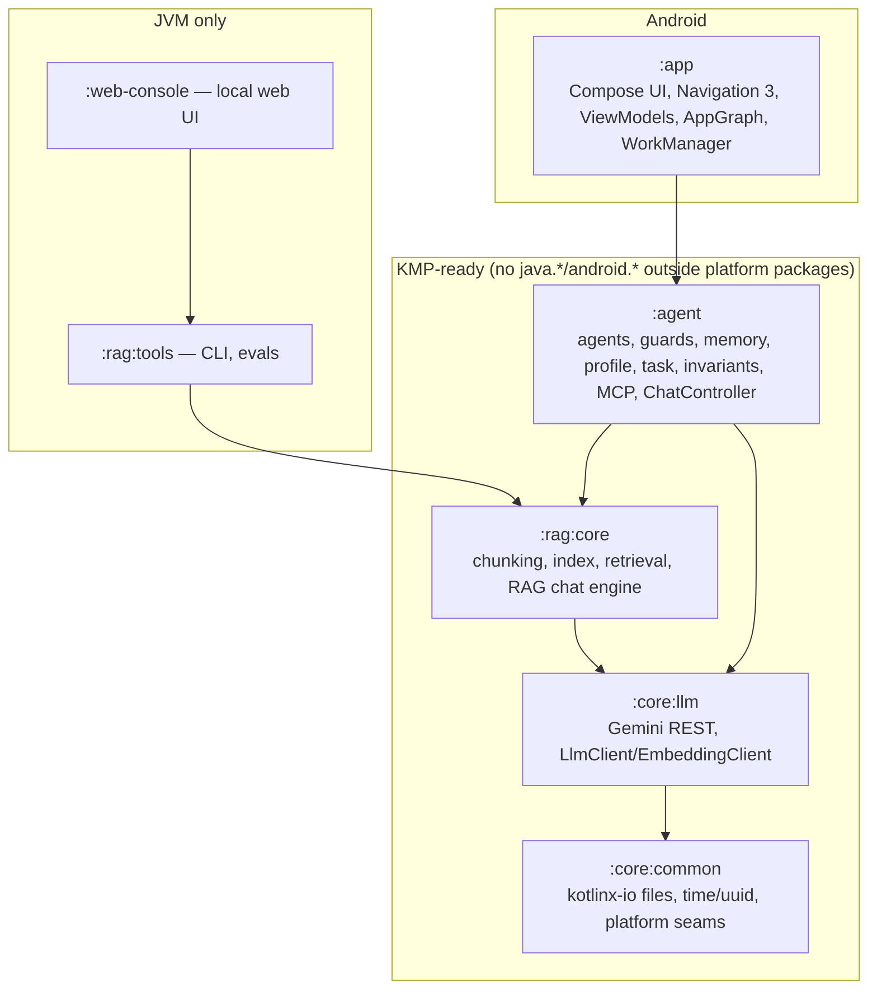
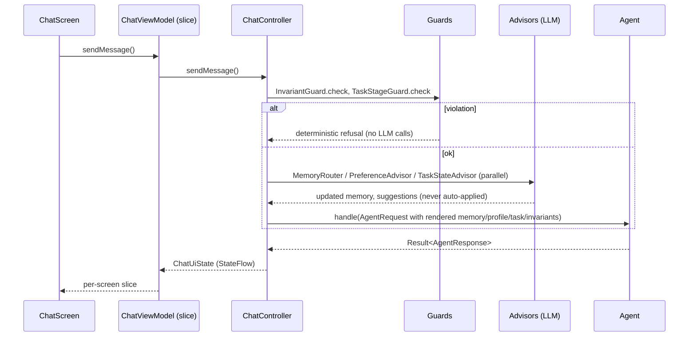
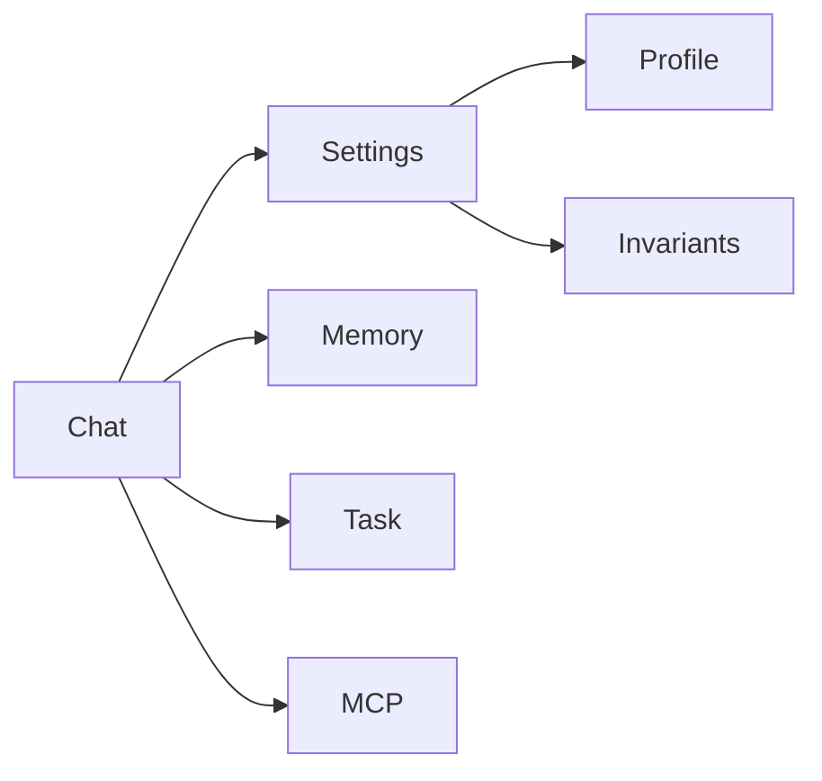

# Architecture

Educational Android "Personal Trainer" app: a Gemini-backed chat **agent** with layered memory,
personalization, a task state machine, invariants, MCP tool-calling and RAG. Plus JVM tooling
(RAG CLI, local web console). Day-by-day design notes live in `docs/dayNN-*.md` (history); this
page and `docs/modules.md` / `docs/agent-patterns.md` describe the **current** structure.

## Layers

Dependency rule: arrows point downward only. `:app` is the only module that knows Android
(`filesDir`, assets, WorkManager, Compose). Everything below it must stay platform-neutral;
`./gradlew checkKmpReadiness` (part of `check`) enforces it for `core/common`, `core/llm`,
`rag/core`, `agent`.

## One chat turn

Key properties:
- Guards run **before** any LLM call; refusals are deterministic and enforced inside the agent
  too (`LlmAgent` re-checks invariants), never only in the UI.
- Advisors only *suggest*; a user tap (Apply) is the only thing that changes profile/task state.
- Each mechanism's token cost is tracked separately (`TokenUsage`, `*TokensTotal` in `ChatUiState`).

## UI layer

- `ChatController` (in `:agent`, plain class, takes a `CoroutineScope`) owns all state as
  `StateFlow<ChatUiState>` and all use-cases. It is created once by `AppGraph` so state survives
  navigation.
- `ChatUiSlices.kt` projects `ChatUiState` into per-screen states (`ConversationState`,
  `SettingsState`, `ProfileState`, `InvariantsState`, `MemoryState`, `TaskScreenState`).
- `ui/<feature>/` holds `XScreen` + `XViewModel` (extends `FeatureViewModel`, exposes `slice { … }`
  and forwards intents to the controller). Panels (`MemoryPanel`, `TaskPanel`, …) are stateless
  composables taking values + lambdas.
- Navigation 3 (`ui/navigation/AppNavigation.kt`): `@Serializable data object XKey : NavKey`,
  `rememberNavBackStack`, `NavDisplay` + `entryProvider`. Add a screen = new key + `entry<Key>`.

## Persistence

Every store is a small class over a kotlinx-io `Path` writing one JSON file (`FILE_NAME`
constant): chat history, long-term memory, working memory (per branch), profile, task state,
transition log, invariants, workout log/summary, saved plans. `load()` falls back to a default on
missing/corrupt files. `AppGraph` is the only place mapping names to `filesDir`.
RAG index is a bundled asset (`rag/index/structure.json`, copied by `copyRagIndex`).

## Build

Version catalog `gradle/libs.versions.toml`; AGP 8.13.2, Kotlin 2.4, compileSdk 36, JVM 17
toolchain. Navigation 3 1.1.2 and Compose BOM 2026.05.00 are pinned to what compileSdk 36 supports.
Tests: `./gradlew check` (JUnit4 + `kotlinx-coroutines-test`; Android UI has no automated tests).

## KMP migration path (not started)

Convert `core/*`, `rag/core`, `agent` from `kotlin("jvm")` to `kotlin("multiplatform")` (move
`src/main/kotlin` → `commonMain`, JVM-only seams → `jvmMain`/`androidMain` via `expect/actual`:
`defaultHttpEngine`, `isUnresolvedHost`, normalization, `File→Path` bridge). `java.io.IOException`
already replaced by `kotlinx.io.IOException`. Remaining blockers: MCP Kotlin SDK client and
`rag/core` test fixtures; UI would need Compose Multiplatform.
